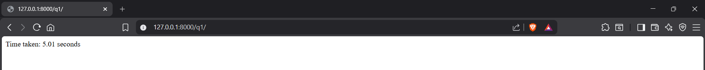
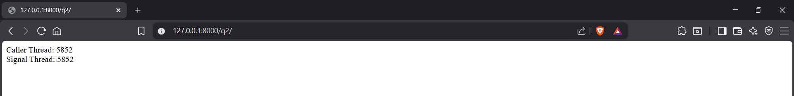
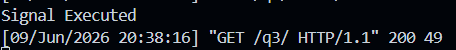
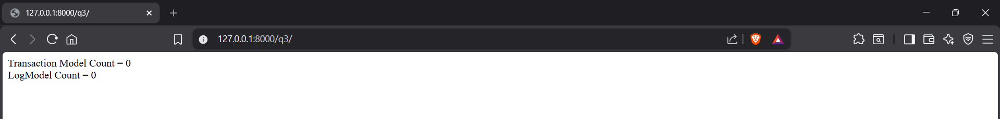

# Topic: Django Signals

## What are Django Signals?

Django Signals are a mechanism that allows certain senders to notify a set of receivers when specific actions occur. Signals help decouple applications by allowing one part of the application to react to events occurring elsewhere without modifying the original code.

Commonly used signals include:

* `pre_save`
* `post_save`
* `pre_delete`
* `post_delete`
* `m2m_changed`

In this assignment, the `post_save` signal is used to demonstrate the behavior of Django signals.

---

# Question 1

**By default are Django signals executed synchronously or asynchronously? Please support your answer with a code snippet that conclusively proves your stance.**

## Answer

By default, Django signals are executed **synchronously**.

This means that when a signal is triggered, Django waits for all signal handlers (receivers) to finish execution before continuing the execution of the caller.

## Code

### [signals.py](signals_app/signals.py)

```python
import time
from django.db.models.signals import post_save
from django.dispatch import receiver
from .models import SyncTestModel

@receiver(post_save,sender=SyncTestModel)
def sync_test_signal_reciever(sender, instance, **kwarg):
    print("Signal Started")
    time.sleep(5)
    print("Signal finished")
```

### [views.py](signals_app/views.py)

```python
import time
from django.http import HttpResponse
from .models import SyncTestModel

def test_sync_signal(request):
    start_time = time.time()

    SyncTestModel.objects.create(name="Test")

    end_time = time.time()

    total_time = end_time - start_time

    return HttpResponse(
        f"Time taken: {total_time:.2f} seconds"
    )
```

## Output

**Attach Screenshot Here**

* Terminal output showing:


* Browser output showing:


## Conclusion

The request waits until the signal receiver completes execution. Since the response is delayed by the 5-second sleep inside the signal receiver, it proves that Django signals are executed synchronously by default.

---

# Question 2

**Do Django signals run in the same thread as the caller? Please support your answer with a code snippet that conclusively proves your stance.**

## Answer

By default, Django signals execute in the same thread as the caller.

## Code

### [signals.py](signals_app/signals.py)

```python
import threading
from django.db.models.signals import post_save
from django.dispatch import receiver
from .models import ThreadTestModel

@receiver(post_save, sender=ThreadTestModel)
def test_thread_signal_reciever(sender, instance, **kwargs):
    import signals_app.views
    signals_app.views.signal_thread_id = threading.get_ident()
```

### [views.py](signals_app/views.py)

```python
import threading
from django.http import HttpResponse
from .models import ThreadTestModel

signal_thread_id = None

def test_thread_signal(request):
    global signal_thread_id

    caller_thread_id = threading.get_ident()

    ThreadTestModel.objects.create(name="Thread Test")

    return HttpResponse(
        f"Caller Thread: {caller_thread_id}<br>"
        f"Signal Thread: {signal_thread_id}"
    )
```

## Output



## Conclusion

The caller thread ID and signal thread ID are identical. This demonstrates that Django signals run in the same thread as the caller by default.

---

# Question 3

**By default do Django signals run in the same database transaction as the caller? Please support your answer with a code snippet that conclusively proves your stance.**

## Answer

Yes. By default, Django signals execute within the same database transaction as the code that triggered them.

## Code

### models.py

```python
from django.db import models

class TestModel(models.Model):
    name = models.CharField(max_length=100)

class LogModel(models.Model):
    message = models.CharField(max_length=100)
```

### [signals.py](signals_app/signals.py)

```python
from django.db.models.signals import post_save
from django.dispatch import receiver
from .models import TransactionTestModel, LogModel

@receiver(post_save,sender=TransactionTestModel)
def test_transaction_signal_reciever(sender, instance, **kwargs ):
    LogModel.objects.create(
        message="Created From signal"
    )

    print("Signal Executed")
```

### [views.py](signals_app/views.py)

```python
from django.db import transaction
from django.http import HttpResponse

from .models import TransactionTestModel, LogModel

def test_transaction_signal(request):
    TransactionTestModel.objects.all().delete()
    LogModel.objects.all().delete()

    try:
        with transaction.atomic():
            TransactionTestModel.objects.create(
                name="Transaction Test"
            )

            raise Exception("Force RollBack")
    except Exception:
        pass

    transaction_test_count = TransactionTestModel.objects.count()
    log_count = LogModel.objects.count()

    return HttpResponse(
        f"Transaction Model Count = {transaction_test_count}<br>"
        f"LogModel Count = {log_count}"
    )
```

## Output




## Conclusion

The signal successfully executed and created a LogModel record. However, when the transaction was rolled back, both the TestModel and LogModel records were removed from the database.

This proves that the signal receiver executed within the same database transaction as the caller.

---

# Final Conclusions

1. Django signals are executed synchronously by default.
2. Django signals run in the same thread as the caller by default.
3. Django signals execute within the same database transaction as the caller by default.

All conclusions were verified through practical Django project implementations and execution results.
