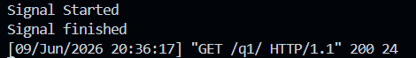

# Topic: Custom Classes in Python

## Question

Create a `Rectangle` class with the following requirements:

1. An instance of the `Rectangle` class requires `length:int` and `width:int` to be initialized.
2. We can iterate over an instance of the `Rectangle` class.
3. When an instance of the `Rectangle` class is iterated over, it should first return its length in the format:

```python
{"length": <VALUE_OF_LENGTH>}
```

followed by its width in the format:

```python
{"width": <VALUE_OF_WIDTH>}
```

---

## Solution

The `Rectangle` class is implemented using Python's iterator protocol through the `__iter__()` method.

### rectangle.py

```python
class Rectangle:

    def __init__(self, length: int, width: int):
        self.length = length
        self.width = width

    def __iter__(self):
        yield {"length": self.length}
        yield {"width": self.width}
```

---

## Explanation

### Constructor

The `__init__()` method initializes the Rectangle object with the required length and width values.

```python
rect = Rectangle(10, 5)
```

After initialization:

```python
rect.length = 10
rect.width = 5
```

---

### Iteration

The `__iter__()` method makes the Rectangle object iterable.

When Python encounters:

```python
for item in rect:
    print(item)
```

it automatically calls:

```python
rect.__iter__()
```

The method yields two dictionary objects in the required order:

```python
{"length": 10}
{"width": 5}
```

---

## Test Code

```python
rect = Rectangle(10, 5)

for item in rect:
    print(item)
```

---

## Output



Example Output:

```python
{'length': 10}
{'width': 5}
```

---

## Conclusion

The Rectangle class successfully implements Python's iteration protocol using the `__iter__()` method.

When iterated, the object returns:

1. The length in the format `{"length": value}`
2. The width in the format `{"width": value}`

This satisfies all requirements specified in the problem statement.
